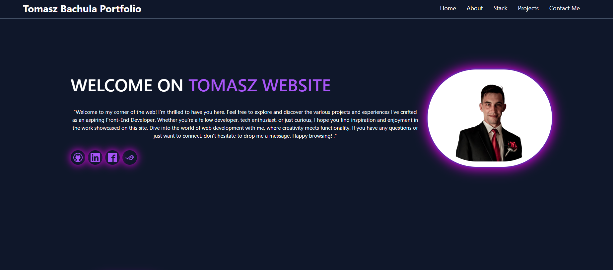
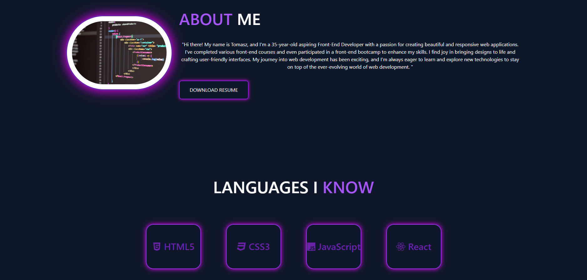
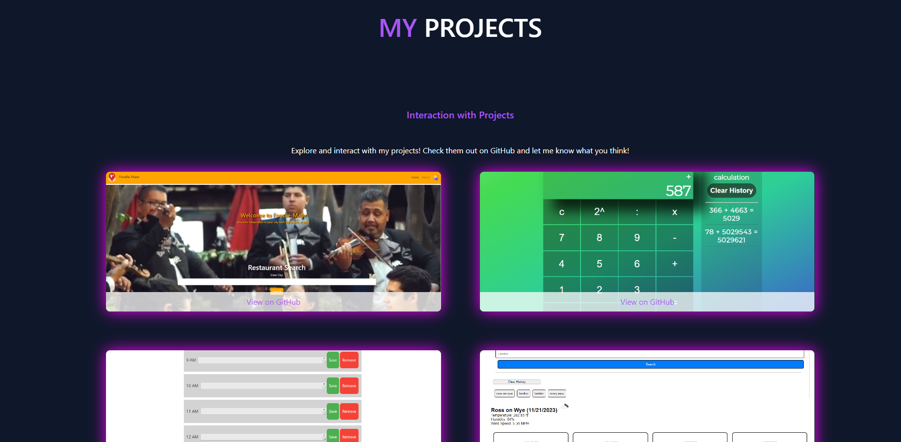
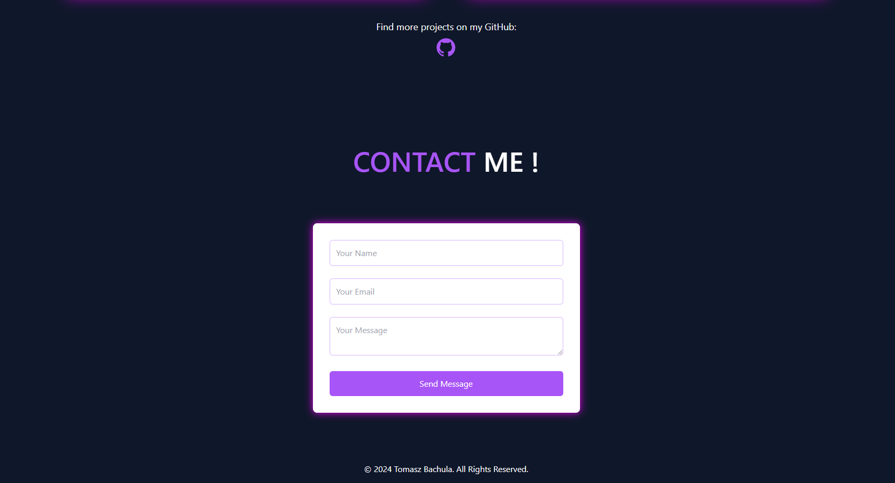

## Project: Portfolio - Tomasz Bachula
## Description:
The Portfolio Project by Tomasz Bachula is a website created as a business card and portfolio for aspiring Front-end Developer - Tomasz Bachula. This website serves as a presentation of skills, projects, and contact information.

## Technologies:
React: Utilized for building interactive components and managing the application state.
Vite: A fast and modern environment for JavaScript and TypeScript-based projects.
Tailwind CSS: A CSS framework enabling quick and easy styling of components.
AOS (Animate on Scroll): A library for adding animation effects while scrolling through the page.
Email.js: A service for handling the contact form and sending email messages.
Project Structure:
src:
## Components:
About.jsx: Section containing a brief history about Tomasz Bachula with animation.
Banner.jsx: Banner with a header and scroll button to the next section.
Contact.jsx: Contact form with AOS animations and integration with Email.js for message sending.
Nav.jsx: Navigation allowing scrolling to different sections of the page.
Project.jsx: Section presenting projects using AOS for animation.
Stack.jsx: Section showing programming languages that Tomasz Bachula knows, with AOS effects.
App.jsx: Main file containing the structure of the page and importing all components.
main.css: Main Tailwind CSS stylesheet.
## Usage Instructions: 
Install Dependencies:

# bash

npm install

# Run the Project:

# bash

npm run dev
# Build the Project:

bash

npm run build

## Project Features:
Interactive Animations: AOS library used to add animated effects while scrolling through the page.
Contact Form: Integration with Email.js allows sending email messages from the contact form.
Responsive Design: Tailwind CSS used to ensure a responsive and visually appealing design.
ScrollSpy Navigation: Navigation automatically highlights the current section while scrolling.
## Photos:

## License:
This project is licensed under the MIT License. 
## Links:
https://github.com/bakomans/react-portfolio-by-Tomasz 
https://bakomans.github.io/react-portfolio-by-Tomasz/